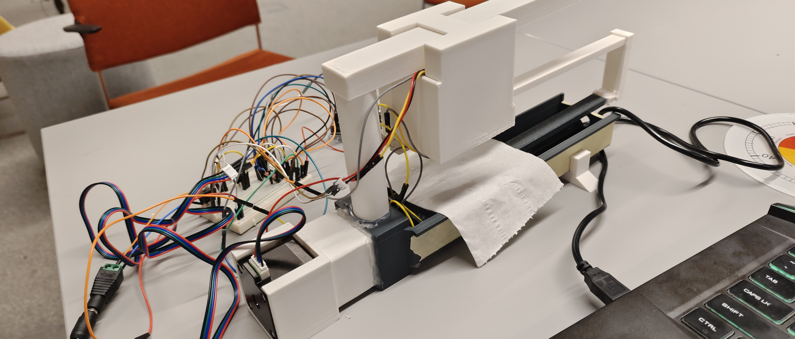
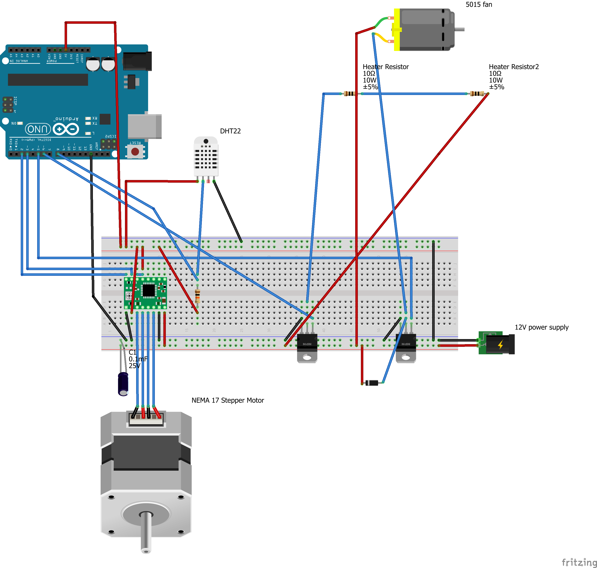

# Paper Protector



---

## Video Demonstration

**Watch the system in action**: [Paper Protector Demo on Bilibili](https://www.bilibili.com/video/BV1xwraBiE8S)

*The video file is also available in this repository at [`Materials/QQ视频20260112051459 (online-video-cutter.com).mp4`](https://github.com/iiishop/Paper-Protector/blob/main/Materials/QQ%E8%A7%86%E9%A2%9120260112051459%20(online-video-cutter.com).mp4), but GitHub may not display it directly due to file size. Please use the Bilibili link above for online viewing.*

---

## 1. What it does

This project is an automated paper preservation system that detects and removes localized moisture from documents through precision scanning and targeted thermal intervention.

**Scanning Mode**: The device performs incremental X-axis scanning with a NEMA 17 stepper motor, moving at 1.498mm per revolution. During the scan:
- **DHT22 sensor** (Phase 2): Monitors real-time humidity and temperature with EMA filtering (α=0.3) to compensate for sensor lag.
- **AS7341-V2 NIR sensor** (Phase 1, damaged): Previously detected moisture at 60Hz via water molecule absorption spectra using 850nm IR LEDs.
- **Forced-induction sampling**: A 5015 fan at 50% power actively pushes moisture through paper fibres toward the sensor, accelerating response time from ~5s to ~2s.
- **Position tracking**: Non-blocking motor control ensures each reading corresponds to a precise spatial coordinate, generating ~140 data points over a 210mm path.

**Wet Spot Detection**: The web interface analyzes scan data using gradient-based dynamic threshold adjustment:
- **Humidity gradient calculation**: Detects rising/falling trends to predict true moisture levels.
- **Hysteresis compensation**: Lowers threshold by 30% during rising trends; raises by 10% during falling trends to avoid false positives.
- **Spatial mapping**: Blue circular markers with percentage overlays appear on the digital twin interface, indicating exact locations of moisture (>threshold RH%).

**Drying Mode**: Once wet spots are identified, the system applies localized thermal intervention:
- **10W heating array** (two 10Ω 10W resistors): PWM-controlled (0-255 range) for adjustable heat intensity.
- **5015 centrifugal fan**: PWM-controlled airflow (0-255 range) for forced-convection drying.
- **Efficiency**: Achieves ~8× faster moisture removal compared to natural evaporation (45s vs 358s for 15% RH reduction).
- **S-curve drying profile**: Initial lag (0-5s) due to sensor equilibration, rapid phase (5-27s), deceleration near equilibrium (27-45s).

**Web Dashboard**: Real-time "Digital Twin" interface with <200ms telemetry latency:
- **Visualization Zone**: Animated paper strip with synchronized red position indicator, horizontal humidity bar chart, and persistent wet spot markers.
- **Control Zone**: Live actuator telemetry (0-255 PWM values), adjustable scan length (up to 210mm), moisture threshold calibration (Zero-set), and manual motor/fan/heater control.
- **Serial PubSub Protocol**: Topic-based MQTT-like messaging (`topic:payload\n`) over USB serial for bidirectional Arduino-Python-WebSocket communication.

**Calibration**: Mandatory "Zero-set" routine establishes baseline humidity for different paper stocks, neutralizing material hygroscopicity before scanning.

---

## 2. Hardware

### Bill of Materials (BOM)

| **Category** | **Component** | **Specifications** | **Qty** | **Notes** |
|--------------|---------------|-------------------|---------|-----------|
| **Microcontroller** | Arduino Uno (Rev3) - ICSP | ATmega328P, 16MHz | 1 | Central controller with USB serial interface |
| **Motion Control** | NEMA 17 Stepper Motor | Bipolar, 1.8° step angle, 2.4 kg·cm holding torque, 15.4V, 0.28A | 1 | Lead screw drive for X-axis scanning (1.498mm/rev) |
|  | Pololu A4988 Driver | SO16 package, micro-stepping capable | 1 | Stepper motor driver with current limiting |
| **Environmental Sensing** | DHT22 Sensor | Digital output, 3.3-5.5V DC, polymer humidity capacitor | 1 | **Phase 2**: Current humidity/temperature sensor |
|  | AS7341-V2 NIR Sensor (optional) | 10-channel spectral sensor, 850nm IR LEDs ×4 | 1 | **Phase 1**: High-speed moisture detection (damaged) |
| **Thermal Intervention** | 5015 Centrifugal Fan | 12V DC, 50×50×15mm | 1 | Forced-convection airflow for drying and sampling |
|  | 10Ω 10W Resistors | SMD 2512 package, ±5% tolerance | 2 | Series-connected heating array (20Ω total, 10W) |
| **Power Electronics** | N-Channel MOSFETs | TO-220 package, PTH | 2 | PWM control for fan and heater (separate channels) |
|  | 12V DC Power Supply | With power plug | 1 | External supply for high-current actuators |
|  | Rectifier Diode | 1N4001, MELF DO-213 AB (SMD) | 1 | Reverse polarity protection |
|  | Electrolytic Capacitor | 0.1mF (100µF), 25V, 100 mil THT | 1 | Power supply filtering |
| **Passive Components** | 10kΩ Resistor | 0.25W, ±5%, 4-band, THT, 400 mil pitch | 1 | Pull-down/pull-up resistor for MOSFET gates |
| **Assembly** | Breadboard (or Perfboard) | Standard 830-point breadboard | 1 | **Option A**: Breadboard for prototyping<br>**Option B**: Solder onto perfboard for permanent installation |
|  | Jumper Wires | DuPont connectors, assorted lengths | Various | Male-to-male, male-to-female for breadboard connections |
| **Mechanical** | 3D-Printed Enclosure | PLA material | 1 | Custom housing for motor and lead screw assembly |
|  | Lead Screw & Nut | T8 lead screw, 8mm diameter | 1 | Linear motion conversion (1.498mm per motor revolution) |
|  | Stainless Steel Mesh | Fine mesh for paper support | 1 | Allows airflow through paper during forced-induction sampling |

### Assembly Notes:
- **Split-Power Architecture**: Arduino Uno powered via USB (5V logic); 12V rail for motor, fan, and heater via external supply.
- **Voltage Isolation**: Keep 12V actuator power rail electrically isolated from 3.3V/5V logic to prevent sensor damage.
- **MOSFET Configuration**: Use 10kΩ pull-down resistors on MOSFET gates; Arduino PWM pins (D5, D6) control fan and heater independently.
- **Breadboard vs. Soldering**: Breadboard recommended for initial testing; migrate to perfboard for reduced noise and improved reliability in production use.

---

## 3. Wiring Diagram


**Figure 1: Complete breadboard wiring layout** - Shows connections between Arduino Uno, A4988 stepper driver, DHT22 sensor, N-channel MOSFETs, and power distribution. The diagram illustrates the split-power architecture with USB power for logic (5V) and external 12V DC supply for actuators (motor, fan, heater).

---

## 4. Libraries

### Arduino Libraries (Install via Arduino IDE Library Manager)

| **Library** | **Author** | **Version** | **Use Case** | **Installation** |
|-------------|-----------|-------------|--------------|------------------|
| **DHT sensor library** | Adafruit | ≥1.4.4 | **Phase 2**: DHT22 temperature/humidity sensor | `Sketch → Include Library → Manage Libraries → Search "DHT sensor library"` |
| **Adafruit AS7341** | Adafruit | ≥1.3.0 | **Phase 1**: AS7341-V2 NIR sensor (optional) | `Sketch → Include Library → Manage Libraries → Search "Adafruit AS7341"` |

**Dependency**: Both libraries require **Adafruit Unified Sensor** library (automatically installed).

### Sensor Selection:
- **Current Implementation (Phase 2)**: Install **DHT sensor library** for DHT22 sensor with forced-induction compensation.
- **Optional (Phase 1)**: Install **Adafruit AS7341** for high-speed NIR moisture detection at 60Hz (requires AS7341-V2 sensor and 850nm IR LEDs).

**Note**: The codebase supports both sensors; uncomment the appropriate `#include` directive in `PaperProtector.ino` based on your hardware configuration.

---

## 5. How to Run

### Step 1: Clone the Repository
```bash
git clone https://github.com/iiishop/Paper-Protector
cd Paper-Protector
```

### Step 2: Open Arduino Project
Open `Backend/PaperProtector/PaperProtector.ino` in Arduino IDE.

### Step 3: Install Required Libraries
Install the necessary Arduino libraries via **Library Manager** (see [Section 4: Libraries](#4-libraries)):
- **DHT sensor library** by Adafruit (for DHT22 sensor)
- OR **Adafruit AS7341** by Adafruit (for AS7341-V2 NIR sensor, optional)

### Step 4: Hardware Connection
1. Assemble the circuit according to the [Wiring Diagram](#3-wiring-diagram).
2. Connect Arduino Uno to your computer via USB Type-B cable.
3. Connect the 12V external power supply to the breadboard power rail.

### Step 5: Upload Firmware to Arduino
1. Select **Board**: `Tools → Board → Arduino Uno`
2. Select **Port**: `Tools → Port → COM# (Arduino Uno)` (on Windows) or `/dev/ttyUSB#` (on Linux/Mac)
3. Click **Upload** (→ button) to flash the firmware.
4. **CRITICAL**: After successful upload, **close the Arduino IDE Serial Monitor** to free the COM port for Python backend communication.

### Step 6: Start Python Backend Server
Navigate to the Python backend directory and run the server:

```bash
cd Backend/Python
python main.py
```

**Expected Output**:
```
[INFO] Serial port connected: COM3
[INFO] WebSocket server started on ws://localhost:8765
```

**Troubleshooting**:
- If Python dependencies are missing, install via: `pip install -r requirements.txt`
- If COM port is blocked, ensure Arduino IDE Serial Monitor is closed.

### Step 7: Open Web Dashboard
Open `Frontend/index.html` in a modern web browser (Chrome/Edge recommended):

```bash
# Option A: Direct file open
# Navigate to: file:///path/to/Paper-Protector/Frontend/index.html

# Option B: Local HTTP server (recommended for WebSocket compatibility)
cd Frontend
python -m http.server 8080
# Then open: http://localhost:8080/index.html
```

The dashboard should display:
- Real-time humidity/temperature readings
- Motor position indicator (red line)
- Live actuator telemetry (fan/heater PWM values)
- Calibration and scanning controls

**System is now ready for operation!** Proceed to calibration (Zero-set) before first scan.

